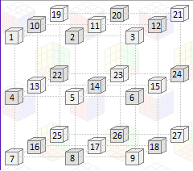

# Snake-Cube
Snake Cube puzzle solver in Prolog

Information about the puzzle came from:
https://www.jaapsch.net/puzzles/snakecube.htm

#### To run:
snake_cube(Snake, Mode).

Snake - The snake that you want to get a solution.

Mode - The amount of solutions you want, it can be 'one' or 'all'.

The cube solution will give an array that has the order in which the positions will be visited.
The positions in the cube are the same as in this image:

